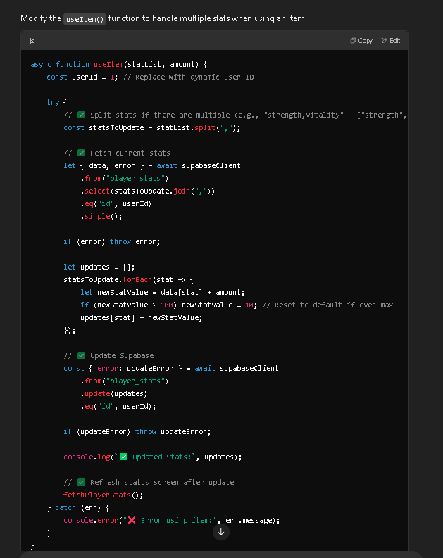
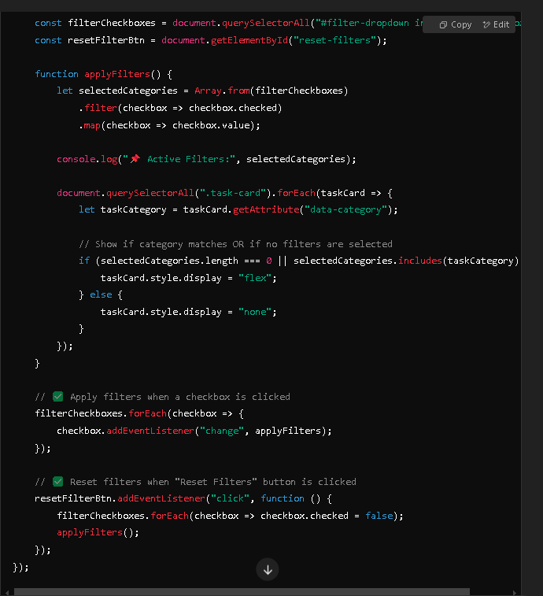
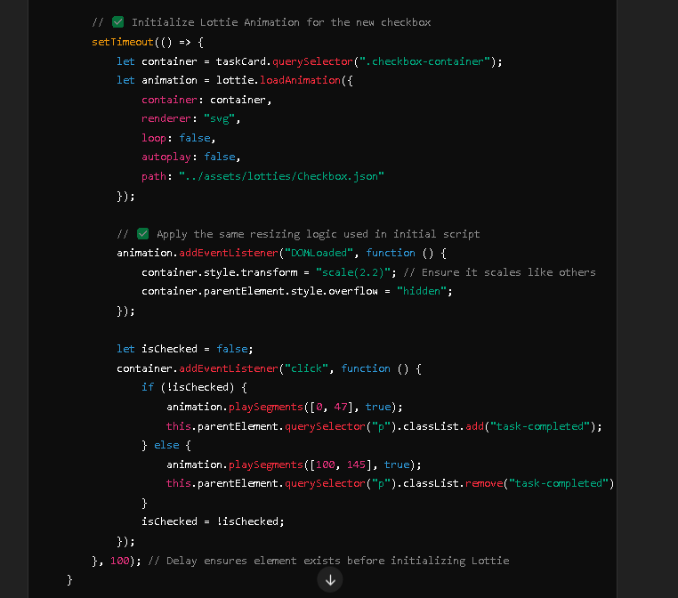
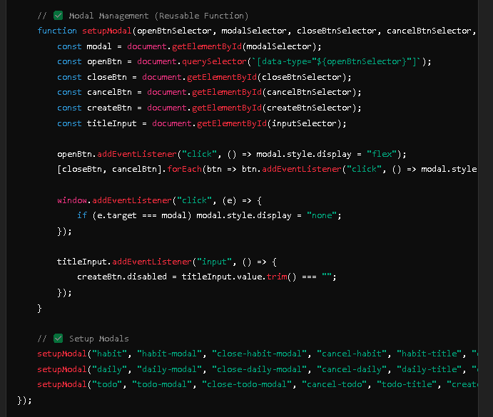
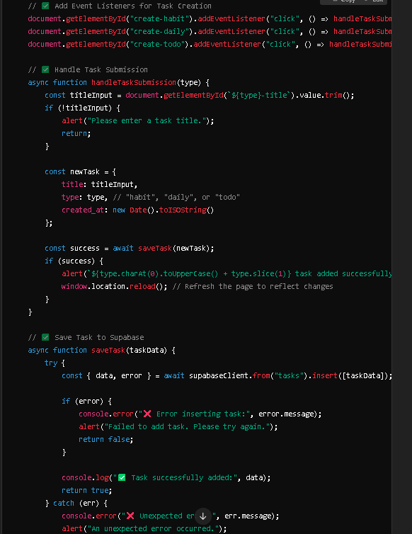

# **Questify – Gamified Habit Tracker**

## **Live Demo**
🔗 [Questify Live Site](https://wykesj.github.io/IP_WebApp_Questify/)

## **Overview**  
Questify is a **gamified habit tracker** that transforms productivity into an **RPG-style adventure**. Designed for users who struggle with **motivation and consistency**, it encourages habit-building through **quests, stat growth, and progression-based rewards**.  

By completing **tasks, tracking habits, and engaging in battles**, users earn **XP, level up, and improve their character stats (Strength, Vitality, Intelligence, Agility)**—all while working toward **real-life self-improvement**. The system ensures **intrinsic and extrinsic motivation**, keeping users engaged through **achievements and structured leveling mechanics**.  

Unlike traditional habit trackers, Questify’s **battle quest system** introduces an **interactive challenge** where users defeat a boss by completing daily quests, reinforcing **consistency and accountability**. The app uses **real-time updates via the Supabase API**, ensuring seamless integration across **habit tracking, inventory, and quest mechanics**.  

Questify is designed to make personal growth **fun, rewarding, and engaging**, helping users stay consistent in their habits while feeling like they’re **on a heroic journey**.  

---

## **Design Process**  
Questify is built for users who:  
- **Struggle with motivation** – They want to build habits but find it difficult to stay consistent.  
- **Enjoy gaming mechanics** – They respond well to RPG elements like **XP, levels, and progression**.  
- **Need structured goal-setting** – They want clear, achievable daily tasks with **tangible rewards**.  

Many existing habit trackers rely on **basic checklists**, which fail to engage users long-term. Questify bridges this gap by making habit-building **interactive and rewarding**, ensuring **different types of motivation (competition, mastery, progression, and autonomy)** are considered.  

To achieve this, Questify follows **three key design principles**:  
1. **Stat Growth & Progression** – Users see **visible improvements** in their character stats as they complete habits.  
2. **Quest-Based Engagement** – Introduces **boss battles and challenges** to reinforce daily consistency.  
3. **Real-Time API Integration** – Ensures **dynamic data updates** for **tasks, inventory, and quests** across all pages.  

---

## **User Stories**  

- **As a user**, I want to track my habits **easily and consistently**, so I can **stay motivated**.  
- **As a player**, I want to **earn XP and level up**, so I feel a **sense of progress** when completing tasks.  
- **As a strategy-focused player**, I want to use **inventory items to enhance my stats**, so I can **optimize my performance**.  
- **As a challenge-seeker**, I want **boss battles that require me to complete tasks**, so I feel **accomplished when I win**.  
---

## **Wireframes & Mockups**  
🔗 [**Figma Wireframe**](https://www.figma.com/design/AmSQLTDpo13z3MZU2C43Ft/ID_IP_Wireframe?node-id=0-1&t=SNDByuzFaDK6qTq4-1)

## **Features**

### **Existing Features**

- **Navigation Bar** – Provides quick access to the **Home, Inventory, and Quests** pages, ensuring seamless navigation across the app.  
- **Dashboard Section** – Displays a **real-time status screen** that dynamically updates **username, level, XP, Strength, Vitality, Intelligence, and Agility**.  
- **Task Management System** – Users can **search for tasks**, filter them by category (**Work, School, Exercise, Errands**), reset filters, add new tasks through a **modal-based task creation system**, and **edit existing tasks**.  
- **Habit Tracking** – Users can categorize habits as **Weak or Strong** and modify them using **+50 XP and -50 XP buttons**, which update the **status screen** accordingly.  
- **Daily and To-Do Tracking** – Users can filter **Dailies** by difficulty (**Easy, Hard**) and check them off using an **animated Lottie checkbox** for visual feedback.  
- **Inventory System** – Users can filter inventory items by type (**Potions, Scrolls, Special Items**) and **sort them by rarity or name (A-Z)**. Hovering over an item reveals its **name and stat benefits**.  
- **Item Usage System** – Clicking an inventory item prompts users to **use it**, updating their stats accordingly and playing a **Lottie animation** for confirmation.  
- **Quest System** – Users can complete **three available quests** per session. Each completed quest **reduces the boss’s HP**, triggering a **Lottie animation** upon success.  
- **Boss Battle System** – Completing all three quests defeats the **boss**, plays a **victory animation**, awards **XP**, and resets the **boss’s HP for the next battle**.  
- **Battle Log** – Records boss interactions, including **damage dealt and the final defeat message**, providing a **text-based history** of battles.  

---

### **Features Left to Implement**  

- **Improved Task Categories** – Add **custom categories** for better task organization.  
- **Achievements System** – Unlockable achievements for completing **long-term goals**.  
- **More Inventory Items** – Introduce **different rarity tiers and additional consumables**.  
- **Boss Variants** – Implement **different bosses with unique mechanics** for added variety.  
- **Task Deletion** – Add a **delete button** to remove unwanted tasks.  
- **Streak System** – Implement a **streak tracker** that rewards users for consecutive task completion.  
- **Equipment System** – Introduce **equippable gear** that provides stat boosts and progression-based advantages.  
- **Leaderboards** – Add a **ranking system** where users can compare progress and achievements.  

## **Technologies Used**  

### **Languages & Frameworks**  
- **HTML5** – Provides the structure for all pages and elements.  
- **CSS3** – Used for styling, layouts, and UI design, including **Normalize.css v8.0.1** for consistent cross-browser styling.  
- **JavaScript (Vanilla JS)** – Handles interactivity, data fetching, and dynamic updates.  

### **APIs**  
- **Supabase** – Used as the external API for managing and retrieving data. The **Table Editor** feature is used to create and manage structured data tables.  
- **Lottie Animations** – Enhances user feedback by playing animations for task completion, quest progress, and inventory actions.  

## **Assistive AI**  

AI tools were used to assist in various aspects of **Questify’s** development, primarily for **code generation, debugging, and optimization**. Below are specific instances where AI contributed to the project:

### **1. Item Usage System (Stat Updates)**
- AI was used to refine the **`useItem()` function**, ensuring multiple stats could be updated simultaneously when an inventory item was used.
- It also helped implement **API integration with Supabase** to fetch and update player stats dynamically.  
📌 **Example: AI-generated code snippet for updating multiple stats when using an item.**  

---

### **2. Task Filtering System**
- AI assisted in optimizing **task filtering logic**, allowing users to filter tasks by **category selection** and dynamically update the UI.  
- AI also helped simplify the **reset filters button**, ensuring proper state reset without unnecessary DOM manipulations.  
📌 **Example: AI-assisted filter logic for task categories.**  

---

### **3. Lottie Animation for Task Completion**
- AI was used to integrate and optimize **Lottie animations for checkboxes**, ensuring they correctly played when marking a daily task as complete.  
- AI also assisted in adjusting **animation scaling and event listeners** to maintain consistency.  
📌 **Example: AI-generated Lottie animation logic for task completion.**  

---

### **4. Modal Management for Task Creation**
- AI was used to streamline the **modal setup** process, allowing a **single reusable function** to manage multiple modal types (habits, dailies, and to-dos).  
📌 **Example: AI-generated modal setup function.**  

---

### **5. Task Submission and API Integration**
- AI assisted in implementing a **task creation system** that stores tasks in Supabase, ensuring proper validation and error handling.  
📌 **Example: AI-assisted task submission logic.**  

---

These examples demonstrate **how AI was leveraged** to enhance development efficiency, optimize functionality, and streamline integration with Supabase and Lottie animations.  

## **Testing**  

The **Questify** application has been manually tested to ensure smooth functionality, responsiveness, and proper integration with Supabase and Lottie animations. Below are key testing scenarios and results.

### **1. Task Management System**  
### Adding a Task  
- Steps:  
  1. Click the **Add Task** button.  
  2. Enter a task title and select a category.  
  3. Click **Create Task**.  
  4. Task appears in the list, and a **Lottie animation** confirms successful creation.  
  5. Refresh the page and verify that the task persists by checking Supabase.  
- Result: Task successfully created and stored in Supabase.  

### Editing a Task  
- Steps:  
  1. Click the **Edit** button next to a task.  
  2. Modify the task title or category.  
  3. Click **Save Changes**.  
  4. The updated task appears correctly.  
  5. Refresh the page and verify that the task updates persist in Supabase.  
- Result: Task updates correctly in the UI and database.  

### Filtering and Resetting Filters  
- Steps:  
  1. Select one or more task categories.  
  2. Verify that only tasks matching the selected categories are displayed.  
  3. Click **Reset Filters**.  
  4. All tasks should be visible again.  
- Result: Filtering and resetting work as expected.  

---

### **2. Habit and Daily Tracking**  
### Using Habit XP Modifiers (+50 XP / -50 XP)  
- Steps:  
  1. Click **+50 XP** or **-50 XP** on a habit.  
  2. Check if the **status screen updates XP and stats dynamically**.  
  3. Refresh the page and confirm that the updated values persist from Supabase.  
- Result: XP and stats update correctly and persist in Supabase.  

### Completing Daily Tasks  
- Steps:  
  1. Click a daily task checkbox.  
  2. Verify that the **Lottie animation plays**.  
  3. Refresh the page to confirm the state persists and is correctly fetched from Supabase.  
- Result: Daily task completion works correctly, and data remains consistent.  

---

### **3. Inventory System**  
### Filtering Inventory Items  
- Steps:  
  1. Select a filter (**Potions, Scrolls, Special Items**).  
  2. Verify that only items matching the selected type appear.  
- Result: Filtering works correctly.  

### Using an Item (Stat Updates)  
- Steps:  
  1. Click on an inventory item.  
  2. Confirm the **use item modal** appears.  
  3. Click **Use** and check the **status screen for updated stats**.  
  4. Refresh the page and verify that the changes persist by checking Supabase.  
- Result: Stats update dynamically and persist correctly in Supabase.  

---

### **4. Quest and Boss System**  
### Completing Quests and Reducing Boss HP  
- Steps:  
  1. Click **Complete Quest** for one of the available quests.  
  2. Confirm the **Lottie animation plays**.  
  3. Check if **boss HP decreases**.  
  4. Refresh the page and verify that the boss HP change persists in Supabase.  
- Result: Boss HP updates dynamically and persists correctly.  

### Defeating the Boss and Resetting HP  
- Steps:  
  1. Complete all three quests.  
  2. Verify that the **victory animation plays**.  
  3. Ensure the **boss HP resets** after defeat.  
  4. Refresh the page and confirm that the reset persists in Supabase.  
- Result: Quest completion triggers the correct animations and resets the boss.  

---

### **5. General Testing**  
### Status Screen Updates  
- Steps:  
  1. Verify that the **status screen correctly retrieves values from Supabase** upon page load.  
  2. Perform any **XP or stat-modifying action** (habit change, item usage, quest completion).  
  3. Check if the **status screen updates dynamically**.  
  4. Refresh the page and confirm that the correct values are displayed.  
- Result: The status screen correctly pulls, updates, and displays real-time values from Supabase.  

### Responsiveness and Cross-Browser Compatibility  
- Tested on: **Chrome, Firefox, Safari, Edge**.  
- Verified that the layout scales properly on **desktop, tablet, and mobile** screens.  

### Page Navigation  
- Verified that navigation between **Home, Inventory, and Quests** works properly.  

---

### **Bugs and Issues Found**  
- The **task editing modal and task creation modal occasionally get mixed up**, leading to incorrect values being displayed.  

---

### **Testing Conclusion**  
The application is fully functional with real-time updates, smooth animations, and proper UI interactions. Any minor bugs have been documented for future fixes.  

## **Credits**  

### **Media**  
- **Potions, Scrolls, Books, and Gem Icons (Inventory Page)** – Sourced from [Kyrise's Free 16x16 RPG Icon Pack](https://kyrise.itch.io/kyrises-free-16x16-rpg-icon-pack/purchase).  
- **Boss Image (Dragon)** – Sourced from [Michael Jay Rov's Pixel Dragons](https://michael-jay-rov.itch.io/pixel-dragons).  

### **Inspiration**  
- This project was **heavily inspired by Habitica**.  
